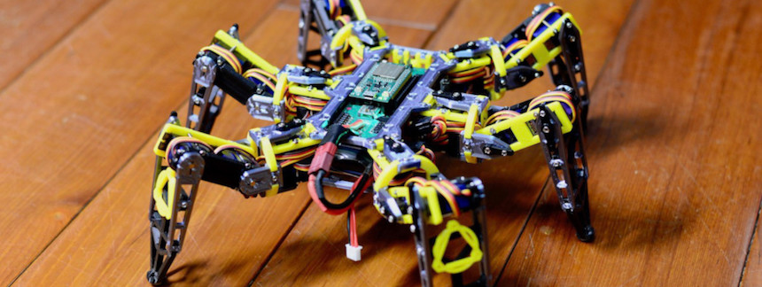

# hexapod-v2-7697

Hexapod v2 using Linkit 7697

這是個 Hexapod (六足昆蟲) 專案

可以用任何手機 (iOS 或 Android) 來控制它的動作 (包括前進，後退，扭動等等...)

可參考以下的 Youtube 影片 https://youtu.be/NJ7DdDEcq3U & https://youtu.be/To2Y6Mhu-CE

> 在 https://smallptsai.github.io/hexapod-v2-7697/ 可以看到更多影片

## 簡介

* 利用 `Linkit 7697` 的 `BLE` 藍牙功能來作到 **遙控**
* 它有六隻腳，每隻腳各有三個關節，總共使用了 `18` 個 **伺服馬達** (TowerPro `MG92B`)
* Linkit 7696 沒有這麼多個 PWM 可用，所以使用了二顆 NXP 的 `PCA9685` 來控制這麼多個伺服馬達
* 動力使用 7.4v 的鋰電池 `2S Lipo battery (7.4v)`, 另外也用了 7 個 `mini360 DC-DC` 穩壓電路，其中 1 個供電給 Linkit 7697, 其它 6 個各負責一隻腳 (三個伺服馬達) 的電力
* 機身則使用 3D 列印 (PLA材質)
* 所有東西  (模型STL檔案, PCB電路圖, 7697代碼) 都以 GPL license 開源, Happy making!

## 技能需求

如果你也想要實現這個專案，會需要以下的技能:

* 機構部分
    * 會使用 `3D 列印`
    * 能夠微調 3D 模型以符合自己的需求 (例如, 使用不同的伺服馬達)
* 電路部分
    * 洗 `PCB` 電路板 (建議找專業 PCB 服務)
    * 焊接 `SMD` 元件 (0805 和 TSSOP28 封裝)
    * 知道如何使用鋰 (`Lipo`) 電池 (充電和保存)
* 軟體部分
    * 使用 `Linkit 7697` (ie. 編譯和上傳程式)
    * 使用 `LRemote` 來連接 7697 和手機

## Table of Content

1. [機構](mechanism/) - 如何組裝3D件 (English only)
1. [電路](electronics/) - 電路說明 (English only)
1. [軟體](software/) - 7697上的軟體 (English only)

## FAQ

1. 如何校正 / 為什麼腳的位置不正

    Calibration 在軟體內有內建, Reboot 後時按一下 7697 上的 USR key, 再用手機連會進到另一個 UI, 可以針對每個 Servo 去調中心點 (offset) 和 比例 (scale), 3d 件上都有個溝槽可以對 0度, 45度和 -45度, 對好後再按 Save 存檔

1. Servo 如何連接, 順序是什麼

    順序都是由內到外, body -> thigh -> foot，不過 layout 時會了走線好看, 有一隻腳的方向是反的，可以在 calibration 時切到不同位置按 45~0~-45度動看看來調整
    請參照 [electronics/#servo-connection](electronics/#servo-connection)

1. 在調整/校正時，左右 Servo 連動，正常嗎?

    不正常, 左右兩張板子有一個地方 (i2c address) 不同，左邊的PCB板的 SJ1 要焊起來
    請參照 [electronics/#sub-x2](electronics/#sub-x2)

1. 請問校正的標準姿勢為何? 例如人形立正或大字型

    所有的關節都在 0 度的位置, 是個 ㄇ 型
    校正要先回到 offset/scale 0 的情況, 再重鎖 servo 擺臂盡量到置中位置後，再用軟體微調~