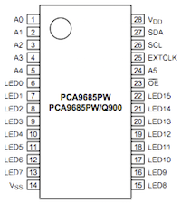

# Electronics

## Connection Diagram

## Bill of Materials

### PCB

Name | Thumbnail | Required |
-------- | --------- | -------- |
main |           | 1 |
sub |           | 2 |

### Components

Name | Thumbnail | Required |
-------- | --------- | -------- |
[Linkit 7697](https://labs.mediatek.com/zh-tw/platform/linkit-7697) |  | 1 |
[mini360 DC-DC](https://www.aliexpress.com/w/wholesale-mini360-dc-dc.html) Buck voltage regulator |  | 7 |
[PCA9865](https://cdn-shop.adafruit.com/datasheets/PCA9685.pdf) (TSSOP28)|  | 2 |
Resistor: 220 ohm (0805) | | 18 |
Resistor: 10K ohm (0805) | | 12 |
Resistor: 470 ohm (0805) | | 1 |
LED: green or any color (0805) | | 1 |
Capacitor: 10 uF (0805) | | 2 |
14 pin 2.54mm female header | | 4 |
4 pin 2.54mm female header | | 2 |
6 pin 2.54mm female header | | 2 |
4 pin 2.54mm 90 degress male header | | 2 |
6 pin 2.54mm 90 degress male header | | 2 |
4 pin 2.54mm male header | | 2 |
3 pin 2.54mm male header (black) | | 6 |
3 pin 2.54mm male header (yellow) | | 6 |
3 pin 2.54mm male header (red) | | 6 |
2 pin 2.54mm male header | | 1 |
Jumper 2.54mm | | 1 |

## PCB detail

> Please use 'Eagle' software to open below schematics

### Main

### Sub (x2)

