# Electronics

## Connection Diagram

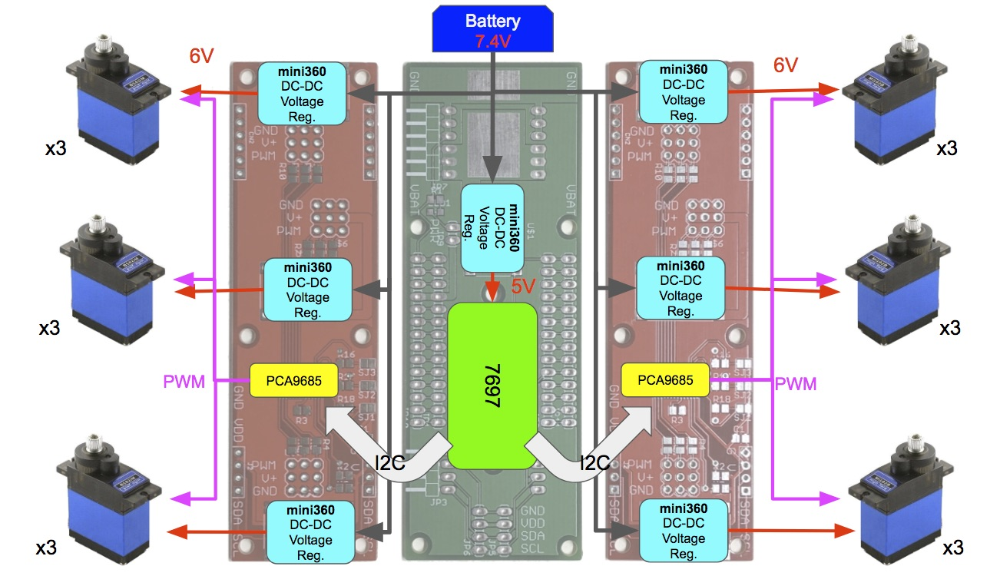

## Bill of Materials (BOM)

### PCB

Name | Thumbnail | Required | Note |
-------- | --------- | -------- | ---- | 
main | 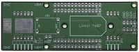 | 1 |
sub | 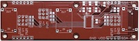 | 2 | there is a difference (SJ1) between the 2 PCB, refer to below

### Components

Name | Thumbnail | Required | Note |
-------- | --------- | -------- | ---- | 
[Linkit 7697](https://labs.mediatek.com/zh-tw/platform/linkit-7697) |  | 1 |
[mini360 DC-DC](https://www.aliexpress.com/w/wholesale-mini360-dc-dc.html) Buck voltage regulator | 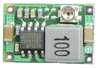 | 7 | adjust to 5V
[PCA9685](https://cdn-shop.adafruit.com/datasheets/PCA9685.pdf) (TSSOP28)|  | 2 | TSSOP28 |
Resistor: 220 ohm (0805) | | 18 | SMD |
Resistor: 10K ohm (0805) | | 12 | SMD |
Resistor: 470 ohm (0805) | | 1 | SMD |
LED: green or any color (0805) | | 1 | SMD |
Capacitor: 10 uF (0805) | | 2 | SMD |
14 pin 2.54mm female header | | 4 |
4 pin 2.54mm female header | | 2 |
6 pin 2.54mm female header | | 2 |
4 pin 2.54mm 90 degress male header | | 2 |
6 pin 2.54mm 90 degress male header | | 2 |
4 pin 2.54mm male header | | 2 |
3 pin 2.54mm male header (black) | | 6 |
3 pin 2.54mm male header (yellow) | | 6 |
3 pin 2.54mm male header (red) | | 6 |
2 pin 2.54mm male header | | 1 |
Jumper 2.54mm | | 1 |

## PCB detail

##### Software 

Please use **Eagle 7.7** software to open schematic files (main.sch/main.brd and sub.sch/sub.brd)

Eagle 7.7 can be found at http://eagle.autodesk.com/eagle/software-versions/1

    Note.
    7.7 is an old and free version of Eagle. 
    Latest Eagle is not free anymore unless you are students

##### Manufacture

There are a lot of online service that can manufacture PCB/PCBA for you (just google `PCB/PCBA`).

Seeed (https://www.seeedstudio.io/fusion_pcb.html) is one of them.

They also provide instructions of generating necessary Gerber files at http://support.seeedstudio.com/knowledgebase/articles/1176532-how-to-generate-gerber-file.

### Main

`main.brd`/`main.sch`

##### Schematic

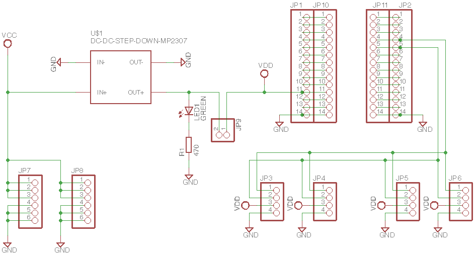

    Note.
    `MP2307` refer to mini360 DC-DC converter

##### Layout

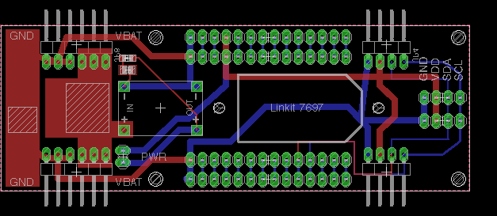

##### PCB

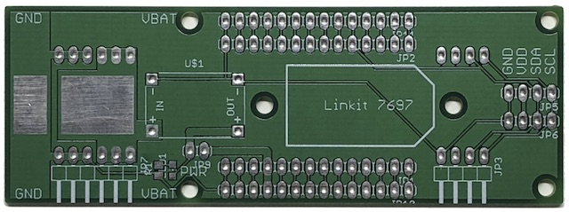

### Sub (x2)

`sub.brd`/`usb.sch`

> There is 1 difference between left and right PCB. The SJ1 of right PCB is left open, but `SJ1` of left PCB should be **closed**. (This is i2c address setting of PCB9865)

##### Schematic

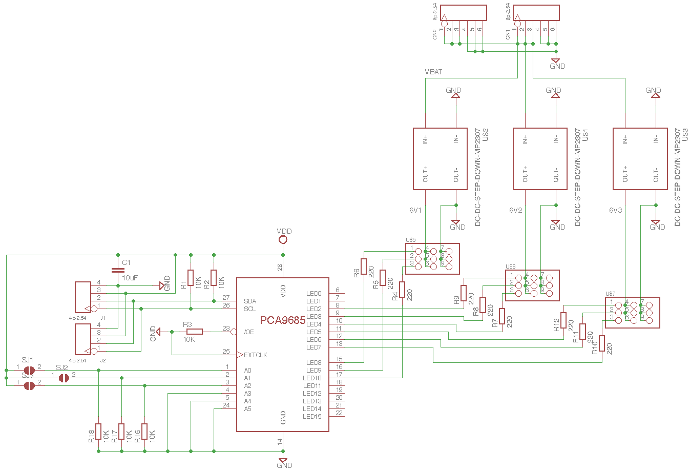

    Note.
    `MP2307` refer to mini360 DC-DC converter

##### Layout

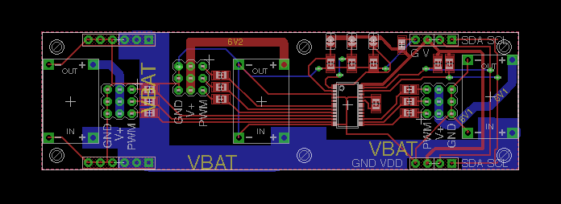

##### PCB

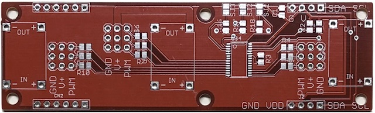

## Servo Connection

Each leg of hexapod has 3 servos (body, thigh, foot), refer to below diagram for correct connection

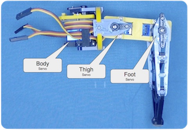

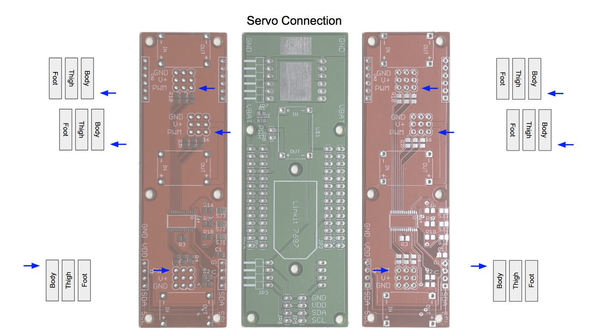

