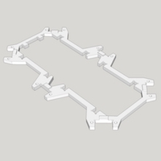
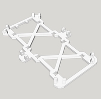
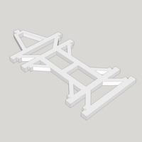
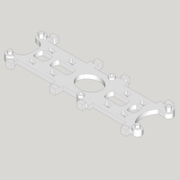
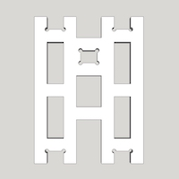
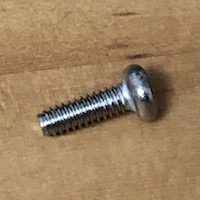
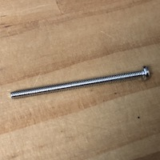
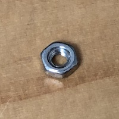
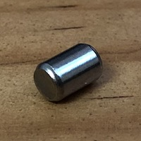

# Bill of Materials

## Servo - MG92B

Servo is the key component. I use TowerPro [MG92B](http://www.towerpro.com.tw/product/mg92b/). It has metal gear (important!).
An hexapod requires 18 of them.

>    The dimension of 3d printed part is highly depended on servo's dimension. 
>    Modification is required if you want to use other alternative servo. 

>    TowerPro MG92B can be found on Ebay seller [servohorns959](https://www.ebay.com/usr/servohorns959), which is listed on TowerPro official website ([Link] (http://www.towerpro.com.tw/about-us-2/)).  I also got mime servo from him.

## 3D-Printed Parts

### Body x 1

Filename | Thumbnail | Required |
-------- | --------- | -------- |
body_top |  | 1 |
body_bottom |  | 1 |
body_center |  | 1 |
body_side_wall |  | 2 |
body_back_wall |  | 1 |

### Leg x 6

Filename | Thumbnail | Required |
-------- | --------- | -------- |
thigh_top |  | 1 (x6) |
thigh_bottom |  | 1 (x6) |
joint_cross |  | 1 (x6) |
joint_top |  | 2 (x6) |
joint_bottom |  | 2 (x6) |
leg_top |  | 1 (x6) |
let_bottom |  | 1 (x6) |
foot_top |  | 1 (x6) |
foot_bottom |  | 1 (x6) |
foot_ground |  | 1 (x6) |
foot_tip |  | 1 (x6) |

## Others

Name | Spec | Thumbnail | Required | Note
---- | ---- | --------- | -------- | ----
Screw | M2 6mm |  | 54 | Servo Arm: 1 x 18 Joint: 4 x 6 Thigh: 2 x 6
Screw | M2 10mm |  | 24 | Thigh: 1 x 6 Pin lock: 1 x 18
Screw | M2 30mm |  | 36 | Servo: 2 x 18
Nuts | M2 |  | 36 | Servo: 2 x 18
Pin (304) | M4 6mm |  | 18 | Servo: 1 x 18
