# Leg Assemble Instruction

Leg assembly instruction video https://youtu.be/oaAE5fC09KQ is also available.

## Preparation

For one leg, you will need 3 MG92B servo and below printed parts

Filename | Thumbnail | Required |
-------- | --------- | -------- |
thigh_top | 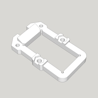 | 1 |
thigh_bottom | 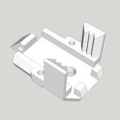 | 1 |
joint_cross | 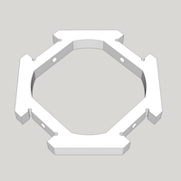 | 1 |
joint_top | 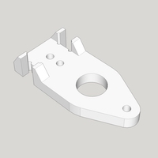 | 2 |
joint_bottom | 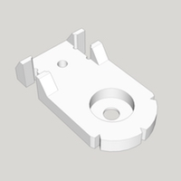 | 2 |
leg_top | 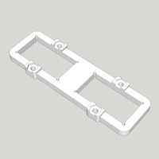 | 1 |
let_bottom | 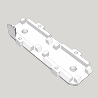 | 1 |
foot_top | 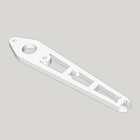 | 1 |
foot_bottom | 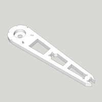 | 1 |
foot_ground | 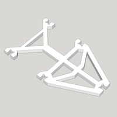 | 1 |
foot_tip | 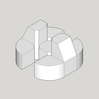 | 1 |

## Step 1

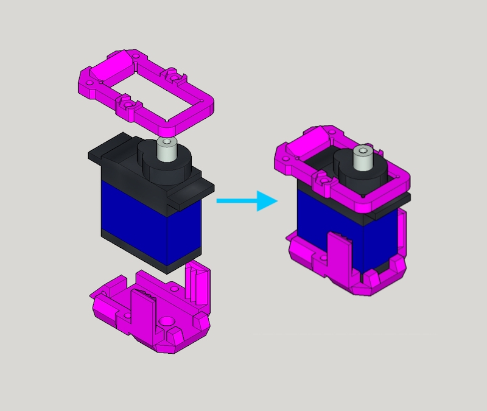

Combine `thigh_top`, `MG92B` and `thigh_bottom`, use M2x30mm screw and nut to secure them together.

## Step 2

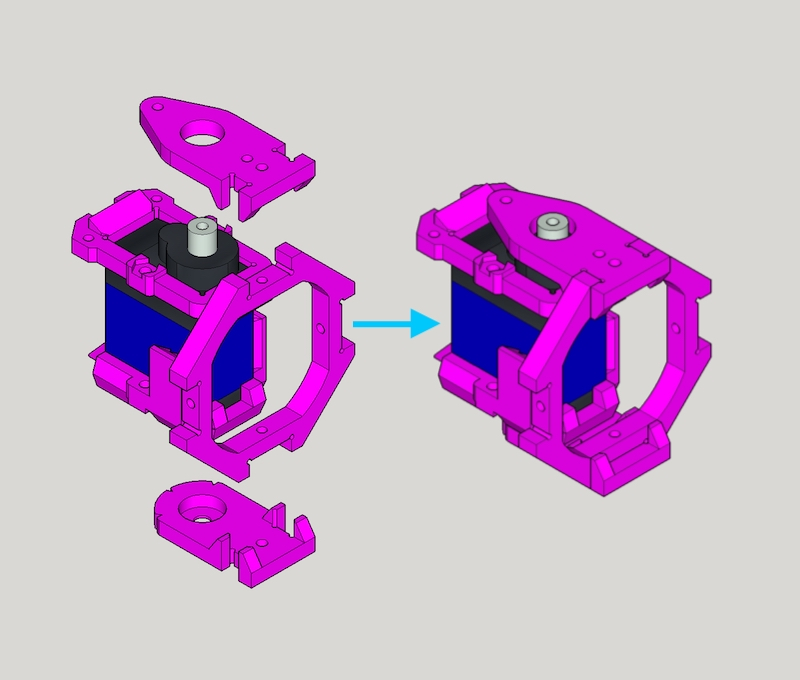

Grab one `joint_cross`, `joint_top` and `joint_bottom` and combine them

## Step 3

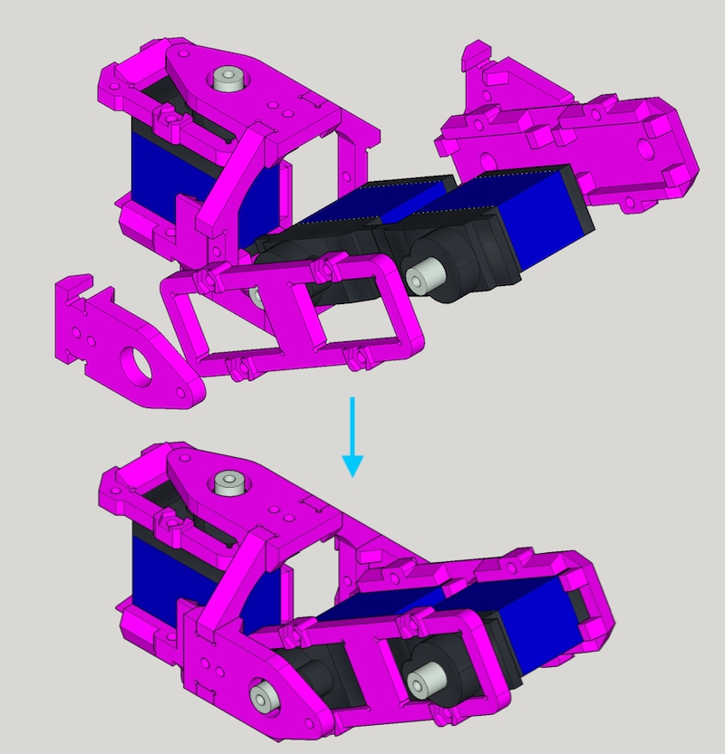

First put 2 x `MG92B`, `leg_top` and `leg_bottom` together with M2x30mm screw and nut.
Then attach `joint_top` and `joint_bottom` altogether

## Step 4

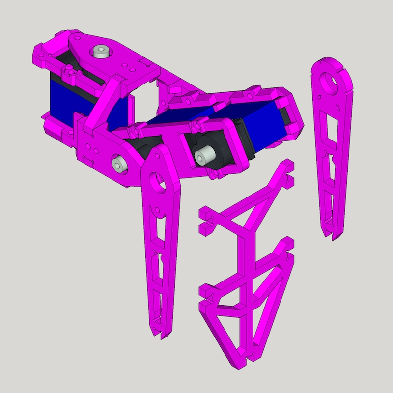

Grab `foot_top`, `foot_bottom` and `foot_ground` (and `foot_top`) and assemble them.

## Finish!

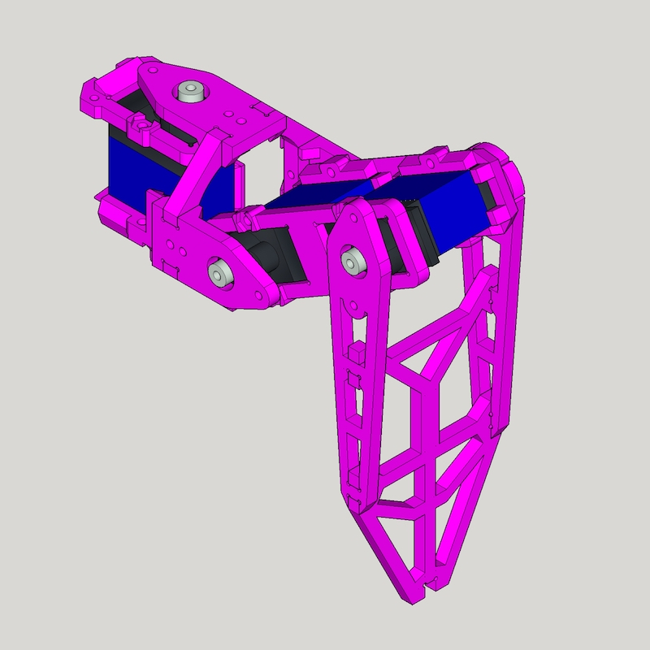

Great, you got 1 leg done, 5 more to go :)

