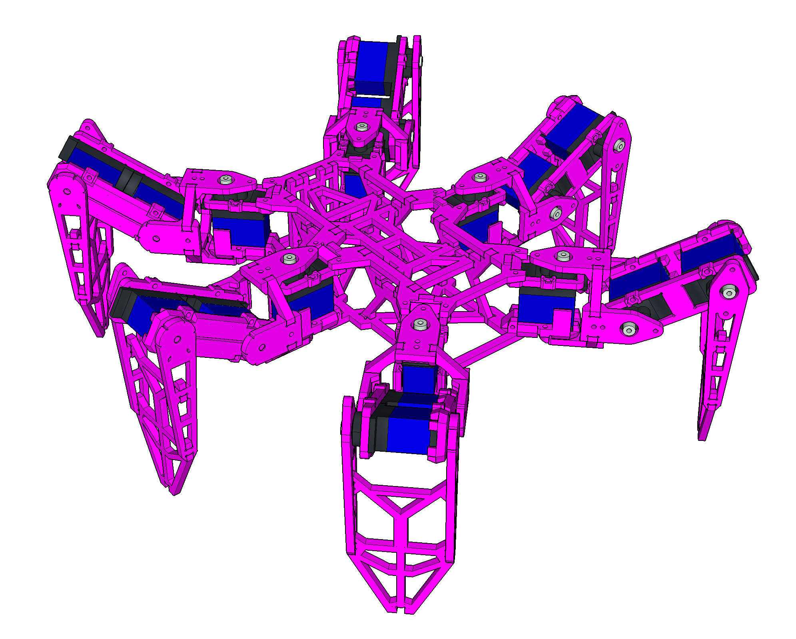
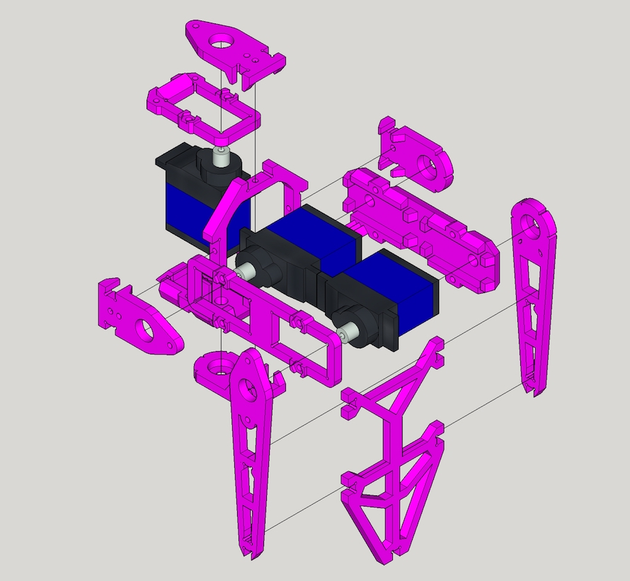

# Mechanism

## Bill of Materials

[BOM](BOM.md)

## Leg Assemble

Please check [Leg Assemble](LEG.md) for more detail instructions

Leg assembly instruction video https://youtu.be/oaAE5fC09KQ is also available.

> Note. Total 6 Legs are required.

## Body Assemble

TBD