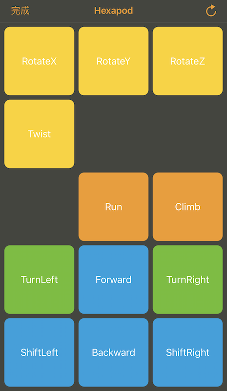
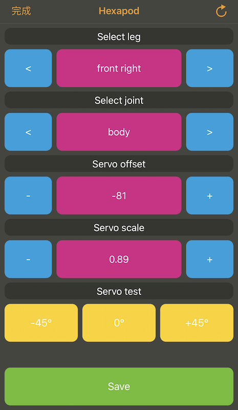

# Software

Software contain 2 parts, one is software of running on Linkt 7697 (an arduino C++ program), another is path generation (a python program).

* hexapod7697: an arduino program running on Linkit 7697
* pathTool: a python program that generate 3D points header, included by `hexapod7697`

## hexapod7697

Files/Folder | Description |
------------ | ----------- |
src/normal_mode | provide normal calibration (forward/backward/turn left/turn right/rotate/etc...) |
src/setting_mode | provide calirbration functions, to make sure servo is correctly aligned. |
src/linkit_control/ | UI control helper |
src/hexapod | hexapod class |
src/hexapod/hal | Hardware Abatraction Layer to running on Linkit 7697 |

> Note hexapod7697 use c++11 and STL, you may encounter problem if want to port it on pure Arduino platform.

#### Normal Mode UI

#### Setting (Calibration) Mode UI

During Linkit 7697 boot up, quick press the user button. 

LRemote App will display above UI.

It is used to adjust the settings of each servo, make sure they align to center.

> Note. Dont press user button when power on, but just after power on.

## pathTool

* Python compatibility:
    * 3.x: ok.
    * 2.x: not verified. 
* Required package
    * numpy: `pip3 install numpy`

